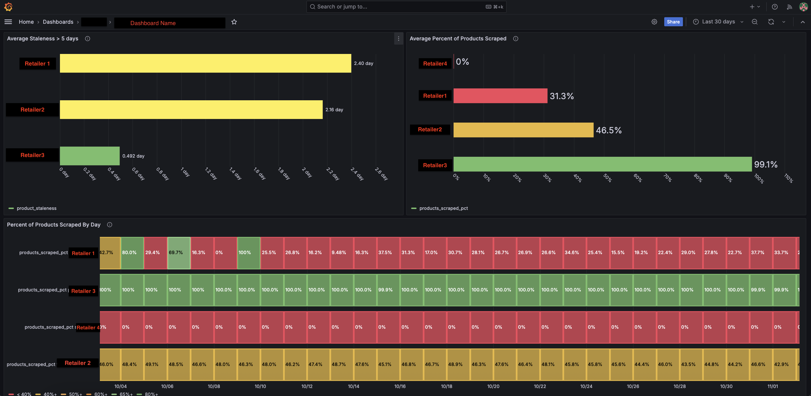

# Crawler-Health-Grafana-Dashboard
A real-time monitoring dashboard built to replace a deprecated internal tool used by the Commercial team (Customer Success, Sales, Analysts) to analyze and validate retailer coverage and crawler performance.

### Background:
This project began as a self-driven exploration of Grafana and evolved into a fully-owned initiative to provide internal teams with fast, reliable access to crawler and retail coverage insights.The dashboard delivers real-time visibility into product assortment coverage, data freshness, retailer counts, and regional tracking — supporting customer calls, demos, and strategic analysis.

### Business Objective:
Provide commercial teams with real-time visibility into crawler performance and retailer coverage, replacing a legacy tool and improving readiness for customer-facing conversations.

### Business Questions:
- Are we capturing the full product assortment?
- How fresh and complete is the crawler data that we are capturing?
- How many retailers are we currently tracking across the different markets?
- Which regions have the highest concentration of tracked retailers?
- How many geographic regions are we actively monitoring?

### Tech Stack:
- Grafana (visualization)
- ClickHouse (analytics database / data warehouse)
- SQL (CTEs, joins, aggregation, data modeling)

### Data Work:
- Explored and analyzed raw ClickHouse tables to identify key entities (crawlers, retailers, product records, timestamps).
- Designed SQL transformations to convert raw crawler data into business-facing metrics, including:
    - Data freshness (based on crawl timestamps and time thresholds to classify data as fresh or stale)
    - Retailer coverage (distinct retailer tracking across regions)
    - Assortment completeness (product availability vs expected catelog) 
- Combined and aggregated data from over 4,000 crawlers to create efficient queries that power real-time dashboard insights.
- Validated metric definitions and outputs against legacy systems and stakeholder expectations.

### Key Challenge:
A key challenge was designing the dashboard for a non-technical audience (Commercial teams), ensuring the data was easy to interpret in preparation for their live customer calls.

This influenced several design decisions, including:
- Using a stoplight-style color gradient to quickly signal performance (e.g., strong vs. weak coverage)
- Prioritizing percentage-based summary metrics in table form over line graphs to make insights immediately actionable
- Enabling multi-retailer filtering to support flexible, real-time analysis
- Presenting normalized metrics (percentages and whole numbers) for consistency and ease of understanding

These choices improved usability and made the dashboard easier to adopt in fast-paced, customer-facing workflows.

### Result:
- Delivered a fully-functional dashboard adopted by Commercial teams (Analysts, Customer Success, Sales).
- Automated real-time insights for 4,000+ crawlers across global retailers.
- Replaced a deprecated internal tool with a centralized, real-time reporting solution.
- Enabled faster and more confident customer conversations by providing instant visibility into crawler performance and coverage.
- Reduced manual effort required to validate crawler health and retailer coverage by eliminating a multi-step workflow (workbook creation, manual validation, and cross-referencing internal tools) needed for client call preparation. 
